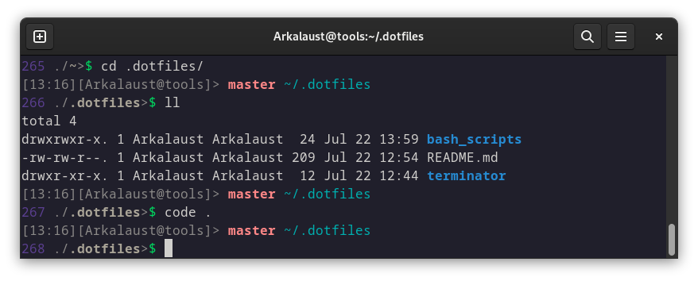

# .dotfiles

## Кастомизация Bash
Настроить под себя строку терминала можно с помощью сервисов-генераторов

[Bash Promt Generator](https://scriptim.github.io/bash-prompt-generator/)

Пример того, как выглядит строка сейчас:



Для создания ссылок, вместо дублирования файлов, введите команду:
```bash
ln -s ~/.dotfiles/terminator/config ~/.config/terminator/config
```

## Быстрая Установка

###  Устанавливаем нужные зависимости, если их нет (wget unzip)

```bash
# для Fedora Linux
sudo dnf install wget unzip -y

# для Ubuntu/Debian Linux
sudo apt-get install wget unzip -y
```


Запустите команду в терминале:

```bash
wget -q https://raw.githubusercontent.com/budaevdigital/.dotfiles/master/install-linux.sh -O - | \
bash -s -- Y1 Y2

```

Замените нужный агрумент на `N` в консоли, если не нужен данный функционал:

- Y1 = Заменяет/Удаляет ваш `.bashrс` файл на скачанный (По-умолчанию: да)

- Y2 = Удаляет скачанные ненужные файлы после установки