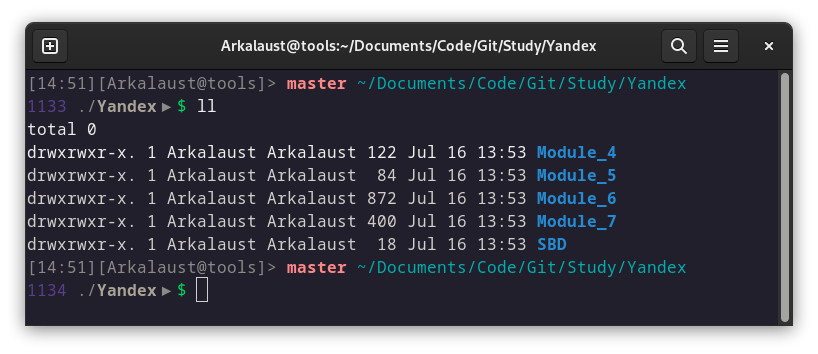

# .dotfiles

## Кастомизация Bash

Пример того, как выглядит строка сейчас:




Объяснение что где...
```text
[time][username@host]> git-branch ~/directories
[number in history] ~/current-directory $(start prompt)
```

Файл bashrc построен таким образом, что вы самостоятельно сможете кастомизировать строку под себя. См. `bash/.shell/.prompt'

Для создания ссылок, вместо дублирования файлов, введите команду:
```bash
ln -s ~/.dotfiles/terminator/config ~/.config/terminator/config
```

## Быстрая Установка

###  Устанавливаем нужные зависимости, если их нет

Для быстрой установки нужны пакеты wget и unzip. 

Если их нет, введите команды ниже.

```bash
# для Fedora Linux
sudo dnf install wget unzip -y

# для Ubuntu/Debian Linux
sudo apt-get install wget unzip -y
```

Запустите команду в терминале и скрипт всё сделает за вас (установит bashrc и удалит ненужные файлы после установки):

```bash
wget -q https://raw.githubusercontent.com/budaevdigital/.dotfiles/master/install-linux.sh -O - | \
bash -s -- Y1 Y2

```

Замените нужный агрумент на `N` в консоли, если не нужен данный функционал:

- Y1 = Заменяет/Удаляет ваш `.bashrс` файл на скачанный (По-умолчанию: да)

- Y2 = Удаляет скачанные ненужные файлы после установки