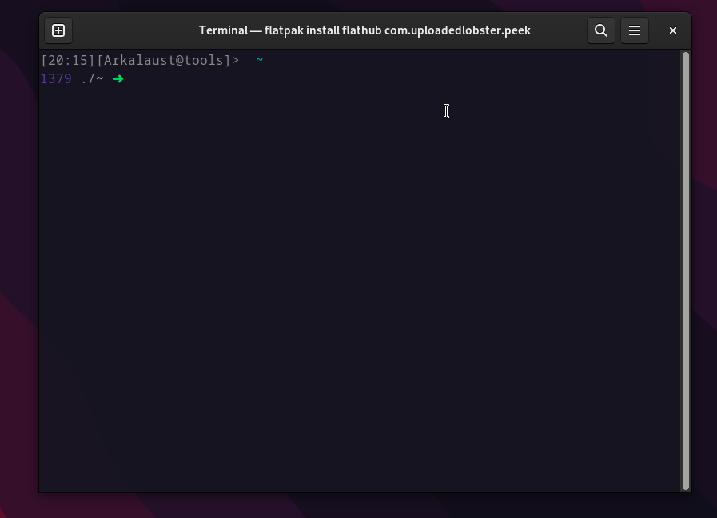

# Конфиги и быстрый старт с Fedora Linux

##  Устанавливаем нужные зависимости, если их нет

> Это нужно только в случае, если вы хотите установить и настроить всё одной командой. См. подробности ниже.

Для быстрой установки нужны пакеты **wget** и **unzip**. 

Если их нет, введите команды ниже.

```bash
# для Fedora Linux
sudo dnf install wget unzip -y

# для Ubuntu/Debian Linux
sudo apt-get install wget unzip -y
```
> Важно! Первоначальная настройка Linux системы (Y2. См. ниже) одной командой, доступна только если у вас Fedora Linux. На другом дистрибутиве, не забудьте указать "N" на 2 позиции аргумента в команде.


## Запуск одной командой

Запустите команду в терминале и скрипт всё сделает за вас (настроит **bashrc** и удалит ненужные файлы после установки):

```bash
wget -q https://raw.githubusercontent.com/budaevdigital/.dotfiles/master/install-linux.sh -O - | \
bash -s -- Y1 Y2 Y3 Y4

```

Замените нужный агрумент на `N` в консоли, если не нужен данный функционал (не оставляйте пустым):

- Y1 = Заменяет/Удаляет ваш `.bashrс` файл на скачанный (По-умолчанию: да (Y1))

- Y2 = Настроить Fedora Linux при первом старте (Если у вас не Fedora Linux, или настройка не нужна, укажите "N")

- Y2 = Устанавливает конфиги для Terminator (Если настройка не нужна, укажите "N")

- Y4 = Удаляет скачанные ненужные файлы после установки.


## Кастомизация Bash

Пример того, как выглядит строка сейчас:



Объяснение что где...
```text
[venv][time][username@host]> git-branch ~/directories
[number in history] ~/current-directory $(start prompt)
```

> Файл **bashrc** построен таким образом, что вы самостоятельно сможете кастомизировать строку под себя. См. `bash/.shell/.prompt'

Для удобства последующего редактирования bash, скриптом создаются ссылки, вместо дублирования файлов. 

Например, вот таким образом:
```bash
ln -s ~/.dotfiles-master/bash/.bashrc ~/.bashrc
```

Для редактирования **bash** достаточно отредактировать файлы в директории `~/.dotfiles-master/` и применить изменения командой:

```bash
source ~/.bashrc
```

### Дополнительные возмоности Bash (Алиасы, функции и т.д.)

Для удобства, функциональность разбита по файлам:
- **alias** = Содержится псевдонимы команд (их сокращенные аналоги)
- **defaults** = Настройки bashrc по-умолчанию
- **export** = Конфигурация WebDAV протокола (облачного хранилища. В моём случае MailCloud)
- **functions** = Дополнительные функции, которые расширяют возможности при работе с терминалом
- **prompt** = Кастомизация строки ввода bash
- **personal_functions** = Мои персональные функции (скорее вам не нужны). Включение VPN одной командой, бэкап Obsiadian заметок и т.д.

Рекомендую ознакомиться с каждым файлом более подробно, чтобы уже потом настроить **bash** под себя

